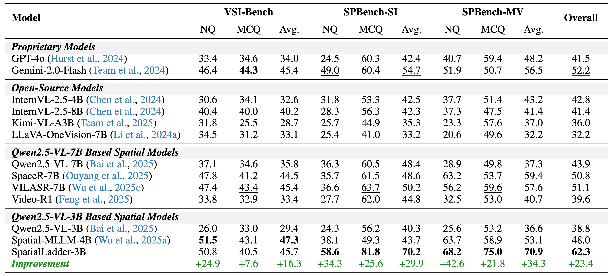

<div align="center">

<h1 style="text-align:center;">
 

SpatialLadder:  Progressive Training for Spatial Reasoning in Vision-Language Models
</h1>

_A progressive three-stage training framework with a high-quality dataset for spatial reasoning_

<a href="https://arxiv.org/pdf/2510.08531" target="_blank">
    
</a>
<a href="https://zju-real.github.io/SpatialLadder" target="_blank">
    
</a>
<a href="https://huggingface.co/hongxingli/SpatialLadder-3B" target="_blank">
    
</a>
<a href="https://huggingface.co/datasets/hongxingli/SpatialLadder-26k" target="_blank">
    
</a>
<a href="https://huggingface.co/datasets/hongxingli/SPBench" target="_blank">
    
</a>

</div>

## 🎉 News
- **2025.10.10:** We release our model, dataset, benchmarks and codes.
- **2025.10.10:** We release our paper.

## 📝 Abstract

Spatial reasoning remains a fundamental challenge for Vision-Language Models (VLMs), with current approaches struggling to achieve robust performance despite recent advances. We identify that this limitation stems from a critical gap: existing methods attempt to learn spatial reasoning directly without establishing the hierarchical foundations of perception and understanding. To address this challenge, we present a comprehensive methodology for building spatial intelligence progressively. We introduce SpatialLadder-26k, a multimodal dataset containing 26,610 samples spanning object localization, single-image, multi-view, and video spatial reasoning tasks, constructed through a standardized pipeline that ensures systematic coverage across modalities. Building on this dataset, we design a three-stage progressive training framework that (1) establishes spatial perception through object localization, (2) develops spatial understanding through multi-dimensional spatial tasks, and (3) strengthens complex reasoning via reinforcement learning with verifiable rewards. This approach yields SpatialLadder, a 3B-parameter model that achieves state-of-the-art performance on spatial reasoning benchmarks, with 23.4% average improvement over the base model, surpassing GPT-4o by 20.8% and Gemini-2.0-Flash by 10.1%. Notably, SpatialLadder maintains strong generalization with 7.2% improvement on out-of- domain benchmarks, demonstrating that progressive training from perception to reasoning is essential for robust spatial intelligence.


## 🌟 SpatialLadder-26k


Effective spatial reasoning requires diverse, high-quality training data spanning from basic perception to complex reasoning. We introduce SpatialLadder-26k, comprising 26,610 samples across four complementary task categories that form a complete spatial learning curriculum.


## 🤖 Progressive Three-stage Training Framework


Building upon SpatialLadder-26k, we design a training framework that systematically constructs spatial intelligence through three progressive stages, each addressing a specific level of the spatial reasoning hierarchy. The framework embodies the principle that robust spatial reasoning emerges from the integration of perception, understanding, and reasoning, with each stage building upon foundations established in previous stages.


## 🎉 Performance



We implement SpatialLadder-3B using Qwen2.5-VL-3B as the foundation model and evaluate it on six benchmarks across in-domain and out-of-domain settings. The results demonstrate that SpatialLadder-3B achieves state-of-the-art performance on in-domain evaluation benchmarks, while also delivering substantial improvements on out-of-domain datasets, thereby validating the effectiveness and generalizability of our training corpus.


## ⚙️ Setup

```bash
git clone https://github.com/ZJU-REAL/SpatialLadder.git
conda create -n spatial-ladder python=3.10 -y
conda activate spatial-ladder
cd SpatialLadder
bash setup.sh
```


## 🚀 Training

### Data Requirements

The model is trained on **[SpatialLadder-26k](https://huggingface.co/datasets/hongxingli/SpatialLadder-26k)**, which we constructed using a standardized annotation pipeline based on **[ScanNet](http://www.scan-net.org/)**. Please make sure to download and prepare the dataset, and place the files in the `VLM-R1/data/images` folder before starting training.


### Quick Start

To train the model through all stages automatically:

```bash
cd VLM-R1/run_scripts
bash run_spld_all.sh
```

This will sequentially execute Stage 1, Stage 2, and Stage 3 training processes. Each stage must complete successfully before the next one begins.

### Manual Training

For manual control or debugging purposes, you can run each training stage individually:

```bash
cd VLM-R1/run_scripts
bash run_spld_stage1.sh # Stage 1
bash run_spld_stage1_2.sh # Stage 2  
bash run_spld_stage1_2_cs.sh # Cold Start
bash run_spld_stage1_2_cs_stage3.sh # Stage 3
```

> **Note**: Make sure to run stages in the correct order, as each stage depends on the outputs from previous stages.

## 📊 Evaluation

### Data Requirements

The supported evaluation datasets include **[VSI-Bench](https://huggingface.co/datasets/nyu-visionx/VSI-Bench)**, **[SPBench](https://huggingface.co/datasets/hongxingli/SPBench)**, **[CV-Bench](https://huggingface.co/datasets/nyu-visionx/CV-Bench)**, **[SPAR-Bench](https://huggingface.co/datasets/jasonzhango/SPAR-Bench)**, and **[ViewSpatial-Bench](https://huggingface.co/datasets/lidingm/ViewSpatial-Bench)**. Before running evaluations, please make sure to download the required datasets and update their paths in the `eval_spld/evaluator.py` file.

### Quick Start

To evaluate the trained model:

```bash
cd VLM-R1/eval_spld
bash run_eval.sh
```

This will run the evaluation pipeline using the default configuration.

### Configuration

To modify evaluation settings, edit the `run_eval.sh` script directly:

```bash
MODEL_NAMES=("qwenvl_3b")
TASK=("VSI-Bench")
SUPPORTED_TASKS=("VSI-Bench" "SPBench-SI" "SPBench-MI" "SPAR-Bench" "ViewSpatial-Bench" "CV-Bench")
...
```

> **Note**: Ensure your model checkpoint path is correct and the evaluation data is properly prepared before running the evaluation script. The **SpatialLadder-3B** checkpoint is avaliabel in our [Hugging Face repository](https://huggingface.co/hongxingli/SpatialLadder-3B).

## 🙏 Acknowledgement

Our training framework is built upon **[TRL](https://github.com/huggingface/trl)** and **[VLM-R1](https://github.com/om-ai-lab/VLM-R1)**. We sincerely thank the developers of these projects for their valuable contributions to the open-source community.

## 📚 Citation
If you find SpatialLadder useful, please consider citing our work:

```bibtex
@misc{li2025spatialladderprogressivetrainingspatial,
      title={SpatialLadder: Progressive Training for Spatial Reasoning in Vision-Language Models}, 
      author={Hongxing Li and Dingming Li and Zixuan Wang and Yuchen Yan and Hang Wu and Wenqi Zhang and Yongliang Shen and Weiming Lu and Jun Xiao and Yueting Zhuang},
      year={2025},
      eprint={2510.08531},
      archivePrefix={arXiv},
      primaryClass={cs.CV},
      url={https://arxiv.org/abs/2510.08531}, 
}

```